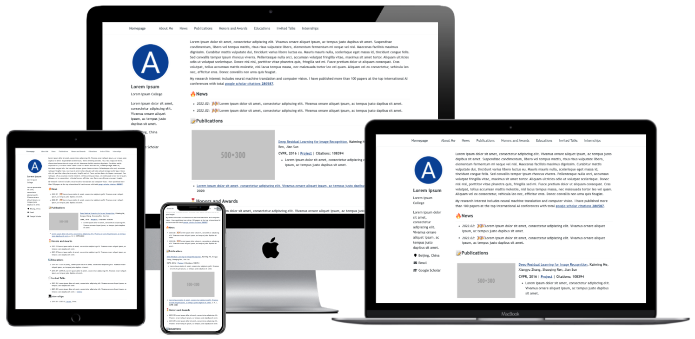

<h1 align="center">
AcadHomepage
</h1>

  | [English README](../README.md) 

一个现代、响应式的学术个人主页模板

     
    
     

示例：
- [演示页面](https://rayeren.github.io/acad-homepage.github.io/)
- [作者主页](https://rayeren.github.io/)

## 主要特性
- **Google Scholar 引用数自动更新**：通过 Google Scholar 爬虫与 GitHub Action 定时更新引用统计。
- **支持 Google Analytics**：只需在 `_config.yml` 中配置即可接入访问统计。
- **高度响应式**：在桌面与移动端都拥有良好展示效果。
- **设计简洁**：默认样式适合学术主页，可轻松替换为自己的信息。
- **良好 SEO**：内置搜索引擎优化配置，帮助搜索引擎收录并排名。

## 快速开始
1. Fork 本仓库并改名为 `USERNAME.github.io`，其中 `USERNAME` 为你的 GitHub 用户名。
2. 配置 Google Scholar 引用数自动更新：
   1. 在浏览器中打开你的 Google Scholar 主页，复制 URL 中的 `user` 参数，例如 `https://scholar.google.com/citations?user=SCHOLAR_ID`。
   2. 在 GitHub 仓库的 `Settings -> Secrets -> Actions` 中新建 `GOOGLE_SCHOLAR_ID`，值为上一步复制的 `SCHOLAR_ID`。
   3. 打开仓库的 `Actions` 页面，启用工作流。此工作流会在提交更新或每天 08:00 UTC 自动生成 `gs_data.json` 并写入 `google-scholar-stats` 分支。
3. 使用 [favicon-generator](https://redketchup.io/favicon-generator) 生成站点图标，并替换 `images/` 目录下的 favicon 文件。
4. 编辑 `_config.yml`：
   - `title`：网站标题（通常为个人姓名）。
   - `description`：网站描述或一句话简介。
   - `repository`：仓库路径，例如 `USERNAME/USERNAME.github.io`。
   - `google_analytics_id`：可选，Google Analytics 统计 ID。
   - `author`：作者信息（头像、邮箱、GitHub、学校/城市等）。
   - `google_scholar_stats_use_cdn`：若访问 GitHub Raw 较慢，可改为 `true` 使用 CDN。
5. 根据需要编辑 `_pages/about.md`，支持 Markdown 和 HTML 混写。
6. 推送至 `main` 分支后，GitHub Pages 会自动构建发布。

## 本地调试
1. 克隆仓库：`git clone https://github.com/USERNAME/USERNAME.github.io.git`。
2. 按 [Jekyll 官方文档](https://jekyllrb.com/docs/installation/) 安装 Ruby、Bundler、GCC、Make 等依赖。
3. 安装依赖：`bundle install`。
4. 启动本地服务：`bash run_server.sh`（或 `bundle exec jekyll serve --livereload`）。
5. 访问 [http://127.0.0.1:4000](http://127.0.0.1:4000)，修改文件后浏览器会自动刷新。

## 致谢
- [AcadHomepage](https://github.com/RayeRen/acad-homepage.github.io)
- [Minimal Mistakes](https://github.com/mmistakes/minimal-mistakes)
- [academicpages](https://github.com/academicpages/academicpages.github.io)
- [Font Awesome](https://fontawesome.com)
